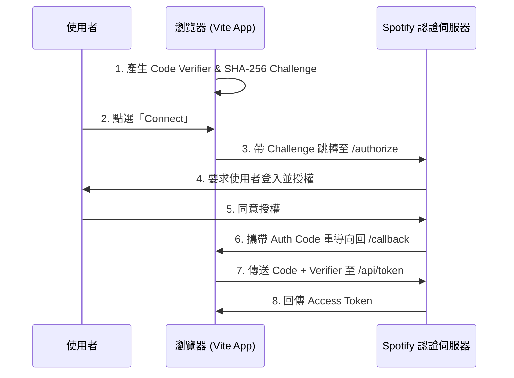

# 🔌 API 與技術介面文件 (API Documentation)

本檔案說明專案所使用的外部 API、本地儲存格式 (LocalStorage Schema) 以及網頁音訊架構 (Web Audio Architecture)。

---

## 1. Spotify PKCE 授權流程

本專案使用不需要 Server 端秘密金鑰 (Client Secret) 的 **PKCE (Proof Key for Code Exchange) OAuth 授權流程**，這對純前端 SPA 應用來說是最安全的認證方式。

### 認證流程圖：


### 關鍵介面參數：

#### A. 請求使用者授權碼 (Authorize Endpoint)
* **網址**：`https://accounts.spotify.com/authorize`
* **Method**：`GET`
* **參數**：
  * `client_id`：使用者自訂的 Spotify App Client ID
  * `response_type`：`code`
  * `redirect_uri`：首頁網址（如 `http://localhost:5173`）
  * `code_challenge_method`：`S256`
  * `code_challenge`：Base64 網址編碼 of SHA-256 Hashed 驗證碼
  * `scope`：`playlist-read-private playlist-read-collaborative streaming user-read-email user-read-private user-modify-playback-state user-read-playback-state` (包含讀取歌單、串流播放、音訊狀態讀取與修改權限)

#### B. 兌換 Access Token (Token Endpoint)
* **網址**：`https://accounts.spotify.com/api/token`
* **Method**：`POST`
* **Content-Type**：`application/x-www-form-urlencoded`
* **Payload**：
  * `client_id`：Client ID
  * `grant_type`：`authorization_code`
  * `code`：重導向拿到的 Authorization Code
  * `redirect_uri`：同上
  * `code_verifier`：本機 session 儲存的原始驗證隨機字串

---

## 2. Spotify Web Playback SDK 播放控制

本專案匯入了 **Spotify Web Playback SDK**，於網頁直接建立一個名為 `Retro Cassette Player 🎵` 的虛擬喇叭裝置。

### A. 裝置連線與初始化 (SDK Setup)
* **CDN 引入**：`https://sdk.scdn.co/spotify-player.js`
* **建立例項**：
  ```typescript
  const player = new window.Spotify.Player({
    name: 'Retro Cassette Player 🎵',
    getOAuthToken: cb => { cb(token); },
    volume: volume
  });
  ```

### B. 播放 API 控制
當載入 Spotify 卡帶時，前端透過 API 指令控制串流播放：

1. **指定裝置播放歌單 (Start Playback)**
   - **網址**：`PUT https://api.spotify.com/v1/me/player/play?device_id={device_id}`
   - **Body (JSON)**：
     ```json
     {
       "context_uri": "spotify:playlist:{playlist_id}",
       "offset": { "position": startOffsetIndex },
       "position_ms": 0
     }
     ```
   - *註：A 面播放偏移位置為 `0`；B 面播放偏移位置為歌單曲目長度的一半。*

2. **暫停/調整音量 (Pause / Volume)**
   - **暫停控制**：呼叫 SDK 本地 `player.pause()` 方法以實現無延遲暫停。
   - **音量控制**：呼叫 SDK 本地 `player.setVolume(volume)` 方法（值範圍為 `0` 到 `1`）。
   - *註：原先使用的 Spotify REST API `/v1/me/player/volume` 與 `/v1/me/player/pause` 端點在 SDK 初始化 `ready` 後立即調用時，會因 Spotify 雲端伺服器與本機裝置啟動時差而返回 `404 (Device not active)` 控制台紅色警告。改用 Web Playback SDK 本地 API 方法調用後已完全消除此報錯。*

3. **歌曲切換控制 (Next / Previous)**
   - **下一首**：呼叫 SDK `player.nextTrack()` 方法 (對應 `POST /v1/me/player/next`)
   - **上一首**：呼叫 SDK `player.previousTrack()` 方法 (對應 `POST /v1/me/player/previous`)

4. **轉移播放裝置 (Transfer Playback)**
   - **網址**：`PUT https://api.spotify.com/v1/me/player`
   - **Body (JSON)**：
     ```json
     {
       "device_ids": ["{device_id}"],
       "play": false
     }
     ```
   - *註：當 SDK 連線成功觸發 ready 時呼叫，將使用者的活動會話鎖定於本瀏覽器裝置。*

### C. Spotify 播放器狀態同步與邊界守衛 (Side End Interception Guard)
由於 Spotify 是一個連續的播放流，為了模擬實體卡帶 AB 面單獨播放與播完停帶功能，系統在 `useSpotifyPlayer.ts` 中實作了以下同步守衛：
1. **`sideFinishedRef` 狀態鎖**：
   - 用於防止 SDK `player_state_changed` 事件的非同步延遲回傳。當監測到當前 Side 的累計播放時間 `sideTime` 超過該面總時長 `sideDuration` 時，系統會將 `sideFinishedRef.current` 設為 `true`，並主動對 SDK 發送 `player.pause()`。
   - 在此狀態下，所有來自 SDK 的播放狀態更新都將被忽略，直到使用者執行了「翻面」或「載入新卡帶」等操作，從而解鎖 `sideFinishedRef`，避免了 Spotify SDK 自動載入下一首歌時，回傳的播放狀態與隨身聽的「停帶翻面」UI 產生畫面衝突（Race Condition）。
2. **重新播放機制**：
   - 當卡帶一面播放結束時，`hasFinishedSide` 會被標記。此時如果使用者不翻面，而是在該面直接點擊 `PLAY` 按鈕，系統會將 `sideFinishedRef.current` 與 `hasFinishedSide` 解除，並將 `sideTime` 與 `trackPosition` 歸零，重新向 Spotify API 發起包含對應 Side 偏移量（Offset Index）的 `startSpotifyPlayback` 請求，使該面從頭播放。

---

## 3. Spotify 歌單抓取 API

獲得 Token 後，前端可直接呼叫 Spotify API 來獲取特定歌單的內容。

* **網址**：`https://api.spotify.com/v1/playlists/{id}` (歌單)、`/v1/albums/{id}` (專輯) 或 `/v1/tracks/{id}` (單曲)
* **Method**：`GET`
* **Headers**：
  * `Authorization`: `Bearer {access_token}`
* **回應結構 (Response Body)**：
  ```json
  {
    "id": "歌單ID",
    "name": "歌單名稱",
    "owner": { "display_name": "建立者姓名" },
    "tracks": {
      "items": [
        {
          "track": {
            "id": "歌曲ID",
            "name": "歌曲名稱",
            "artists": [ { "name": "歌手名稱" } ],
            "duration_ms": 240000,
            "preview_url": "https://p.rap.is.spotify.com/... (30秒音訊MP3連結)"
          }
        }
      ]
    }
  }
  ```

---

## 4. Spotify 串接關鍵痛點與排障 (Spotify Integration Troubleshooting)

在開發與測試 Spotify 串接功能時，曾遇到以下幾個關於 API 機制、帳號權限與 CSS 排版的關鍵痛點，特別記錄於此：

### A. 開發者模式的「白名單限制」與 API 操作可行性 (Developer Sandbox Whitelist Limitations)
* **現象**：非開發者本人的 Spotify 帳號在點擊「Connect」登入時會報錯（例如 `AUTHENTICATION_ERROR`），或無法取得 Access Token。
* **原因**：Spotify App 在建立初期預設處於 **Development Mode (開發模式)**。在此模式下，只有在 Spotify Developer Dashboard 中 **`Users and Access`** 頁面被手動新增 Email 的測試帳戶（上限 25 人，且 Email 需與 Spotify 帳號完全一致，大小寫敏感）才能順利進行認證登入。
* **API 操作限制（關於前端介面直接加入白名單）**：
  > [!IMPORTANT]
  > **Spotify 未提供任何公開 Web API 來允許第三方應用程式動態管理 Sandbox 測試者白名單**。因此，本專案無法在網頁介面上設計「讓使用者/朋友直接輸入 Email 並自動加入白名單」的操作按鈕。所有白名單的新增必須由 App 擁有者手動登入 Spotify Developer Portal 進行管理。
* **解決方案**：
  1. **測試階段**：需由 App 擁有者手動將測試者的 Spotify Email 加入後台的白名單。
  2. **正式上線**：在 Dashboard 中對該 App 點擊 **「Request Extension（申請配額擴展 / 審查）」**。通過審查並發布後，App 會進入正式運作狀態，屆時任何一般的 Spotify 用戶皆能直接授權使用，不再需要手動加入白名單。

### B. 私有/未公開歌單的「API 存取拒絕」 (Private/Unlisted Playlist API Restrictions)
* **現象**：朋友分享的 Spotify 歌單連結，在官方 App 中可以直接點開並播放，但貼入本 App 進行匯入時，API 卻回傳 `404 Not Found` 或 `403 Forbidden`。
* **原因**：
  * **官方 App (Secret Link)**：官方 App 允許透過分享連結直接存取「非公開（Unlisted）」歌單，此連結在用戶端作為存取金鑰。
  * **Web API 限制**：但當第三方應用程式透過 API `GET /v1/playlists/{playlist_id}` 抓取資料時，Spotify 執行了嚴格的隱私安全檢查。如果該歌單未被擁有者設定為**「設為公開」**或**「在個人檔案公開」**，API 就會判定目前呼叫 API 的第三方使用者（非歌單擁有者）無權限讀取，回傳 `404` 錯誤。
* **解決方案**：必須請歌單的擁有者在其 Spotify App 中，點選歌單的 `...` 設定，選擇 **「設為公開」** 或 **「在個人檔案公開 (Publish to Profile / Make Public)」**，API 才能讀取並成功完成卡帶匯入。

### C. 隨身聽 3D/CRT 效果與 body 樣式導致的「彈窗固定定位失效」 (CSS Containing Block Bug)
* **現象**：當使用者在極長頁面（如卡帶工作室）往下滑動點選刪除時，彈窗（Modal）會出現在畫面之外的上方，使用者只能看到暗色遮罩，必須手動滾動才能找到彈窗。
* **原因**：
  * **CSS 包含區塊規範**：在 `position: fixed` 的祖先元素上，若套用了 `filter`、`backdrop-filter`、`transform`、`perspective` 等屬性，會強制讓該元素升級為定位的「包含區塊」，使 `fixed` 元素不再相對於瀏覽器視窗（Viewport）定位，而是退化成相對於該父元素定位。
  * 本專案的隨身聽機身有使用 `transform` / `perspective`，且 `body` 過去設定了 `backdrop-filter: blur(20px)`，這使得彈窗的 fixed 遮罩變成了絕對定位，被拉長到與整個 document 同高（例如 1200px），進而把彈窗定位在整頁正中央（Y=600px），在頂部或底部瀏覽時便會出現在視線外。
* **解決方案**：
  1. **使用 React Portal**：在 `PixelModal.tsx` 中使用 `createPortal` 將彈窗直接掛載至最外層 `document.body`，將 DOM 節點完全抽離 `#root` 與隨身聽特效容器。
  2. **清理 body 樣式**：從 `index.css` 的 `body` 選擇器中徹底移除無實際視覺效果卻會破壞定位的 `backdrop-filter: blur(20px)`，使彈窗定位順利綁定回視窗，隨時垂直居中於目前可見畫面上。

---

## 5. Web Audio API 音訊管線

我們使用 `AudioContext` 將原生 `<audio>` 播放標籤、波形分析儀與音量控制增益器進行連線，繞過行動端音量調節限制，並實現即時的畫素波形圖繪製：

```text
 [ HTML5 Audio Element ] 
         │
         ▼
 [ MediaElementAudioSourceNode ] 
         │
         ▼
 [ AnalyserNode (FFT Size = 64) ] ───► [ Canvas (繪製畫素頻譜) ]
         │
         ▼
 [ GainNode (音量控制增益器) ] 
         │
         ▼
 [ AudioContext.destination (揚聲器) ]
```

---

## 6. 卡帶分享 URL 工具函數 (URL Sharing Utilities)

定義於 [`spotify.ts`](file:///d:/project/pixel-cassette-player/src/services/spotify.ts)，負責將卡帶 JSON 壓縮為可分享的 URL-safe Base64 字串，以及反向解壓。

### `compressString(input: string): Promise<string>`
* **說明**：使用瀏覽器原生 `CompressionStream('gzip')` 壓縮 JSON 字串，並輸出 **URL-safe Base64**（`+`→`-`、`/`→`_`、去除 `=`），可縮短分享網址約 60~80%。
* **輸出格式**：無 `+` , `/` , `=` 字元，可直接放入 URL 參數，無需再次 `encodeURIComponent`。

### `decompressString(base64: string): Promise<string>`
* **說明**：將 `compressString` 產生的 URL-safe Base64 字串解壓回原始 JSON 字串。
* **相容性**：同時接受含 `+`/`/`/`=` 的舊版標準 Base64，維持向下相容。
* **內部處理**：`-` → `+`、`_` → `/`，再補回 `=` 補位，最後以 `DecompressionStream('gzip')` 解壓。

### URL 格式版本
| 版本 | 格式 | 解碼方式 |
|:---|:---|:---|
| **v2（新版）** | `?tape=v2.{gzip_url_safe_base64}` | `decompressString` 非同步解壓 |
| **v1（舊版）** | `?tape={standard_base64}` | `atob` + `decodeURIComponent` 同步解碼 |

> `App.tsx` 載入時會自動判斷前綴，新舊連結皆可正確解析。

---

## 7. 本地儲存 Schema (LocalStorage Format)

我們使用瀏覽器的 `localStorage` 來儲存 Client ID 以及使用者自訂的卡 Tapes 資料。

### A. 卡帶列表鍵：`custom_cassettes`
* **Value**：卡帶物件陣列的 JSON 字串 `Cassette[]`
```typescript
interface Cassette {
  id: string;              // 格式為 custom-{timestamp} 或 spotify-{id}
  title: string;           // 手寫卡帶標題 (大寫)
  artist: string;          // 手寫製作者名稱
  shellColor: string;      // 卡帶外殼 HEX 色值
  stickerColor: string;    // 卡帶標籤貼紙 HEX 色值
  stickerPattern: string;  // 樣式種類: 'solid' | 'stripes' | 'grid' | 'waves'
  labelTextColor: string;  // 文字筆跡 HEX 色值
  isSpotifyPlaylist?: boolean;
  spotifyPlaylistId?: string;
  spotifyUri?: string;     // Spotify 完整 URI (如 spotify:album:xxx)
  tracks: {
    id: string;
    title: string;
    artist: string;
    duration: number;      // 單位：秒
    url: string;           // MP3 音訊 URL
    isSpotifyPreview?: boolean;
  }[];
}
```

### B. 連線資訊鍵：
* `spotify_client_id`：儲存使用者的 Spotify Client ID，避免重複輸入。
* `spotify_access_token`：暫存當前的 Spotify Access Token。
* `spotify_token_expires_at`：過期時間點的 Unix Timestamp（毫秒）。
