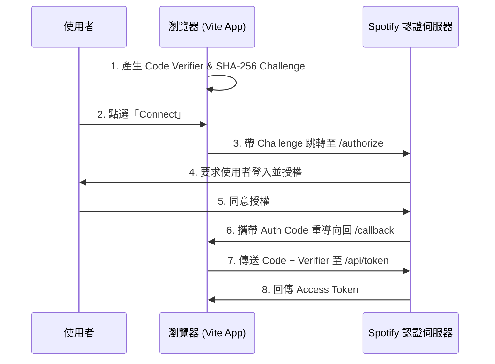

# 🔌 API 與技術介面文件 (API Documentation)

本檔案說明專案所使用的外部 API、本地儲存格式 (LocalStorage Schema) 以及網頁音訊架構 (Web Audio Architecture)。

---

## 1. Spotify PKCE 授權流程

本專案使用不需要 Server 端秘密金鑰 (Client Secret) 的 **PKCE (Proof Key for Code Exchange) OAuth 授權流程**，這對純前端 SPA 應用來說是最安全的認證方式。

### 認證流程圖：


### 關鍵介面引數：

#### A. 請求使用者授權碼 (Authorize Endpoint)
* **網址**：`https://accounts.spotify.com/authorize`
* **Method**：`GET`
* **引數**：
  * `client_id`：使用者自訂的 Spotify App Client ID
  * `response_type`：`code`
  * `redirect_uri`：首頁網址（如 `http://localhost:5173`）
  * `code_challenge_method`：`S256`
  * `code_challenge`：Base64 網址編碼 of SHA-256 Hashed 驗證碼
  * `scope`：`playlist-read-private playlist-read-collaborative streaming user-read-email user-read-private user-modify-playback-state user-read-playback-state` (包含讀取歌單、串流播放、音訊狀態讀取與修改許可權)

#### B. 兌換 Access Token (Token Endpoint)
* **網址**：`https://accounts.spotify.com/api/token`
* **Method**：`POST`
* **Content-Type**：`application/x-www-form-urlencoded`
* **Payload**：
  * `client_id`：Client ID
  * `grant_type`：`authorization_code`
  * `code`：重導向拿到的 Authorization Code
  * `redirect_uri`：同上
  * `code_verifier`：本機 session 儲存的原始驗證隨機字串

---

## 1.1 Spotify Web Playback SDK 播放控制

本專案匯入了 **Spotify Web Playback SDK**，於網頁直接建立一個名為 `Retro Cassette Player 🎵` 的虛擬喇叭裝置。

### A. 裝置連線與初始化 (SDK Setup)
* **CDN 引入**：`https://sdk.scdn.co/spotify-player.js`
* **建立例項**：
  ```typescript
  const player = new window.Spotify.Player({
    name: 'Retro Cassette Player 🎵',
    getOAuthToken: cb => { cb(token); },
    volume: volume
  });
  ```

### B. 播放 API 控制
當載入 Spotify 卡帶時，前端透過 API 指令控制串流播放：

1. **指定裝置播放歌單 (Start Playback)**
   - **網址**：`PUT https://api.spotify.com/v1/me/player/play?device_id={device_id}`
   - **Body (JSON)**：
     ```json
     {
       "context_uri": "spotify:playlist:{playlist_id}",
       "offset": { "position": startOffsetIndex },
       "position_ms": 0
     }
     ```
   - *註：A 面播放偏移位置為 `0`；B 面播放偏移位置為歌單曲目長度的一半。*

2. **暫停/調整音量 (Pause / Volume)**
   - **暫停網址**：`PUT https://api.spotify.com/v1/me/player/pause`
   - **音量網址**：`PUT https://api.spotify.com/v1/me/player/volume?volume_percent={volume_0_to_100}`

3. **歌曲切換控制 (Next / Previous)**
   - **下一首**：呼叫 SDK `player.nextTrack()` 方法 (對應 `POST /v1/me/player/next`)
   - **上一首**：呼叫 SDK `player.previousTrack()` 方法 (對應 `POST /v1/me/player/previous`)

---

## 2. Spotify 歌單抓取 API

獲得 Token 後，前端可直接呼叫 Spotify API 來獲取特定歌單的內容。

* **網址**：`https://api.spotify.com/v1/playlists/{id}` (歌單)、`/v1/albums/{id}` (專輯) 或 `/v1/tracks/{id}` (單曲)
* **Method**：`GET`
* **Headers**：
  * `Authorization`: `Bearer {access_token}`
* **回應結構 (Response Body)**：
  ```json
  {
    "id": "歌單ID",
    "name": "歌單名稱",
    "owner": { "display_name": "建立者姓名" },
    "tracks": {
      "items": [
        {
          "track": {
            "id": "歌曲ID",
            "name": "歌曲名稱",
            "artists": [ { "name": "歌手名稱" } ],
            "duration_ms": 240000,
            "preview_url": "https://p.rap.is.spotify.com/... (30秒音訊MP3連結)"
          }
        }
      ]
    }
  }
  ```

---

## 3. Web Audio API 音訊管線

我們使用 `AudioContext` 將原生 `<audio>` 播放標籤與波形分析儀進行管線連線，實現即時的畫素波形圖繪製：

```text
 [ HTML5 Audio Element ] 
         │
         ▼
 [ MediaElementAudioSourceNode ] 
         │
         ▼
 [ AnalyserNode (FFT Size = 64) ] 
         │
         ├──────────────────────┐
         ▼                      ▼
 [ BiquadFilterNode / Mute ]  [ Canvas (繪製畫素頻譜) ]
         │
         ▼
 [ AudioContext.destination (揚聲器) ]
```

---

## 4. 本地儲存 Schema (LocalStorage Format)

我們使用瀏覽器的 `localStorage` 來儲存 Client ID 以及使用者自訂的卡 Tapes 資料。

### A. 卡帶列表鍵：`custom_cassettes`
* **Value**：卡帶物件陣列的 JSON 字串 `Cassette[]`
```typescript
interface Cassette {
  id: string;              // 格式為 custom-{timestamp} 或 spotify-{id}
  title: string;           // 手寫卡帶標題 (大寫)
  artist: string;          // 手寫製作者名稱
  shellColor: string;      // 卡帶外殼 HEX 色值
  stickerColor: string;    // 卡帶標籤貼紙 HEX 色值
  stickerPattern: string;  // 樣式種類: 'solid' | 'stripes' | 'grid' | 'waves'
  labelTextColor: string;  // 文字筆跡 HEX 色值
  isSpotifyPlaylist?: boolean;
  spotifyPlaylistId?: string;
  spotifyUri?: string;     // Spotify 完整 URI (如 spotify:album:xxx)
  tracks: {
    id: string;
    title: string;
    artist: string;
    duration: number;      // 單位：秒
    url: string;           // MP3 音訊 URL
    isSpotifyPreview?: boolean;
  }[];
}
```

### B. 連線資訊鍵：
* `spotify_client_id`：儲存使用者的 Spotify Client ID，避免重複輸入。
* `spotify_access_token`：暫存當前的 Spotify Access Token。
* `spotify_token_expires_at`：過期時間點的 Unix Timestamp（毫秒）。
