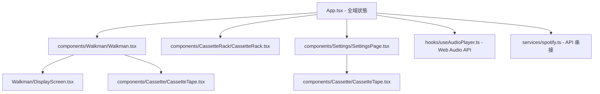
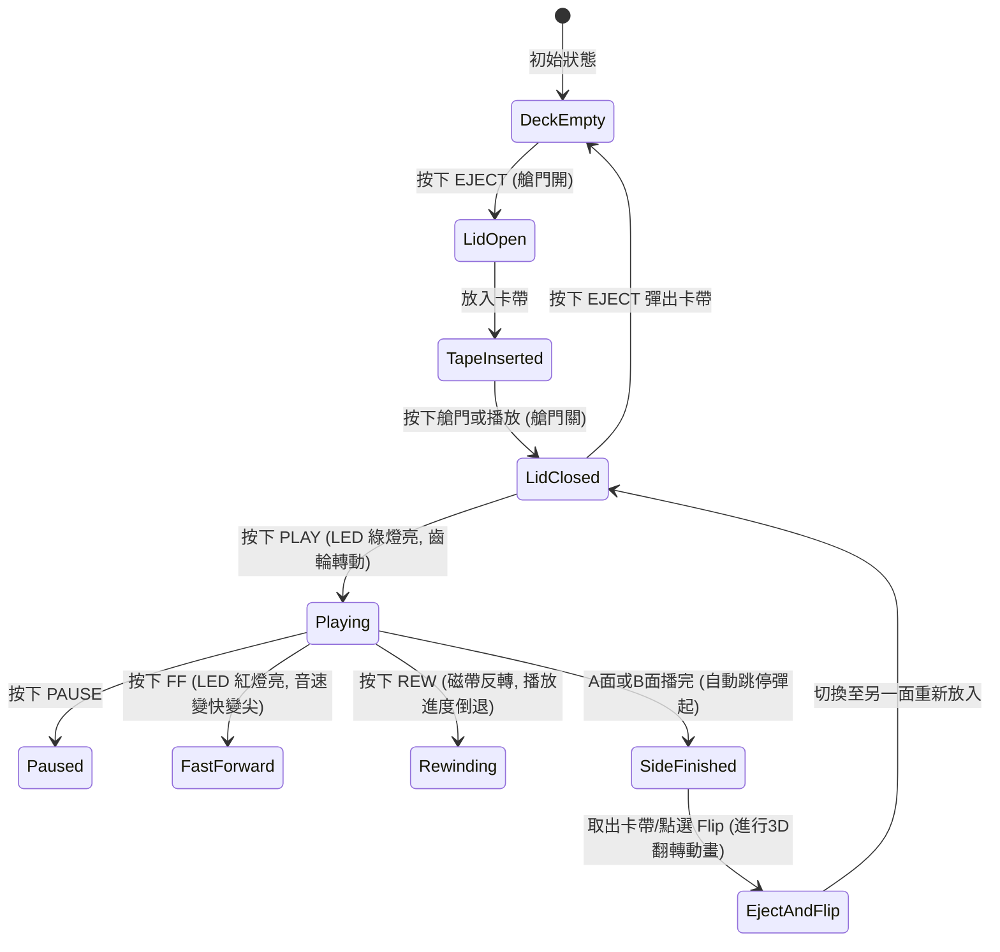

# 📻 專案規劃文件 (Project Planning Document)

本檔案詳述「復古畫素風卡帶隨身聽」專案的產品規劃、系統架構、元件劃分及狀態設計。

---

## 1. 產品願景與定位
打造一個融合**復古硬體操作樂趣**與**現代串流音樂API**的網頁互動體驗。藉由擬真畫素風格的視覺與音效，降低串流應用的冰冷感，為使用者帶來實體卡帶的溫暖與把玩趣味。

---

## 2. 元件架構設計 (Component Architecture)

專案結構劃分為主控端、核心隨身聽、卡帶架與後臺設定四大核心區塊：

### 元件職責說明：
* **`App.tsx`**：管理全域狀態（當前載入卡帶、當前頁面、播放Side、磁帶艙門狀態）。
* **`Walkman.tsx`**：隨身聽機身元件，整合液晶螢幕、按鍵控制項與 3D 卡帶翻轉的動畫容器。
* **`DisplayScreen.tsx`**：畫素液晶顯示螢幕，負責繪製 Canvas 波形與數字時鐘。
* **`CassetteTape.tsx`**：物理卡帶渲染元件，根據進度以 SVG 齒輪進行旋轉、並增減左右軸磁帶繞線寬度。
* **`CassetteRack.tsx`**：卡帶收納架，可點選以自動化流程裝載卡帶。
* **`SettingsPage.tsx`**：卡帶編輯後臺，處理外觀自訂與 Spotify PKCE 授權。
* **`useAudioPlayer.ts`**：核心音訊 Hook，控制 Audio 物件與 `AudioContext` 頻譜串接。

---

## 3. 音訊與進度同步邏輯 (Audio Timeline Engine)

傳統播放器一次只播放一首歌。為模擬「實體卡帶一條帶子錄到底」的體驗，我們設計了**卡帶時間軸引擎 (Cassette Timeline Engine)**：

### 連續時間軸對映：
1. 將當前 Side（A面或B面）的所有曲目時間長度累加，算出該面的總長度（例如 600 秒）。
2. 在隨身聽螢幕與磁帶進度條中，我們只維護一個單一變數 `sideTime`（0 ~ 600 秒）。
3. 播放器執行時，會動態將 `sideTime` 對映到對應的曲目及該曲目的內部播放進度（Offset）：
   * 曲目 1 (長度 180s) ➡️ `sideTime` 0s~180s (播放曲目1，Offset = `sideTime`)
   * 曲目 2 (長度 120s) ➡️ `sideTime` 180s~300s (播放曲目2，Offset = `sideTime - 180s`)
4. 當使用者執行**快轉 (FF)** 時，播放進度將成倍前進（例如以 8 倍速前進）。當進度超過 180s 時，播放引擎會自動載入曲目 2，並將 `playbackRate` 設定為 `4.0`，發出快進尖音；當放開按鍵時，音樂便會在曲目 2 的新進度上恢復播放。

---

## 4. 系統狀態機 (State Machine)

卡帶隨身聽的操作狀態具有高度相依性，我們設計了互斥與連鎖邏輯：

---

## 5. 無伺服器分享架構 (Serverless Sharing Architecture)

為達成讓使用者能輕易將自訂的卡帶設定與 Spotify 歌單分享給親友，本專案實作了**無資料庫 (Backend-less)** 的分享機制：

1. **分享編碼 (Encoding)**：
   當使用者點選分享按鈕時，系統將整個卡帶物件 (`Cassette` JSON) 先進行 `encodeURIComponent`，再轉為 Base64 字串，並附加至網址引數 `?tape={base64_string}`。
2. **接收解碼 (Decoding)**：
   當 `App.tsx` 在元件掛載時 (`useEffect`) 偵測到網址包含 `tape` 引數，即會擷取並進行 `atob` 解碼，還原成卡帶物件。
3. **自動匯入 (Import & Persist)**：
   還原後的卡帶會被賦予一個新的唯一 ID (`shared-{timestamp}`)，並加入至本地端的 `localStorage` 卡帶櫃 (`custom_cassettes`) 中。同時系統會清除網址列的引數以避免重新整理時重複匯入。
   
這項機制能讓創作者在不需要伺服器成本的情況下，透過簡單的超連結於各大通訊軟體分享自己打造的 Mixtape。
