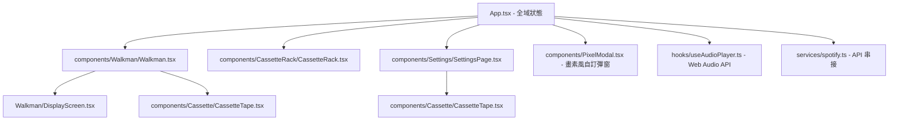
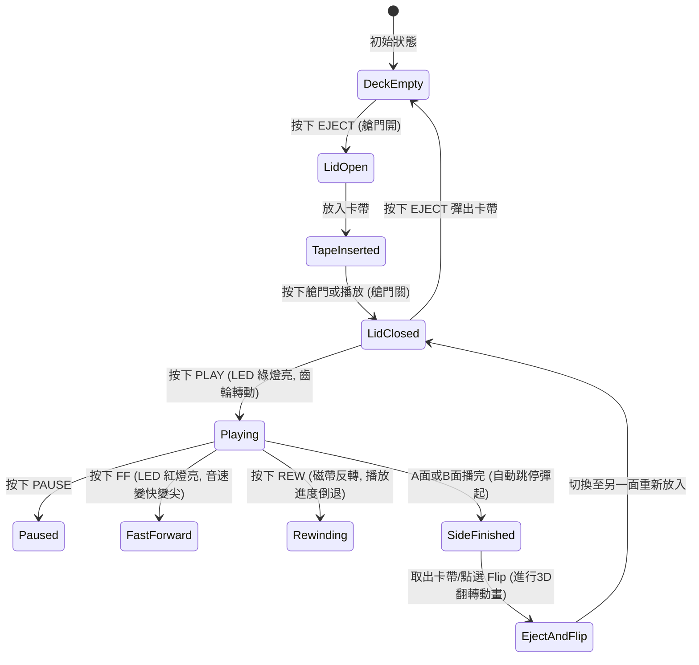

# 📻 專案規劃文件 (Project Planning Document)

本檔案詳述「復古畫素風卡帶隨身聽」專案的產品規劃、系統架構、元件劃分及狀態設計。

---

## 1. 產品願景與定位
打造一個融合**復古硬體操作樂趣**與**現代串流音樂API**的網頁互動體驗。藉由擬真畫素風格的視覺與音效，降低串流應用的冰冷感，為使用者帶來實體卡帶的溫暖與把玩趣味。

---

## 2. 元件架構設計 (Component Architecture)

專案結構劃分為主控端、核心隨身聽、卡帶架與後臺設定四大核心區塊：



### 元件職責說明：
* **`App.tsx`**：管理全域狀態（當前載入卡帶、當前頁面、播放Side、磁帶艙門狀態，以及全域畫素風彈窗狀態與處理器）。
* **`Walkman.tsx`**：隨身聽機身元件，整合液晶螢幕、按鍵控制項與 3D 卡帶翻轉的動畫容器。
* **`DisplayScreen.tsx`**：畫素液晶顯示螢幕，負責繪製 Canvas 波形與數字時鐘。
* **`CassetteTape.tsx`**：物理卡帶渲染元件，根據進度以 SVG 齒輪進行旋轉、並增減左右軸磁帶繞線寬度。
* **`CassetteRack.tsx`**：卡帶收納架，可點選以自動化流程裝載卡帶。
* **`SettingsPage.tsx`**：卡帶編輯後臺，處理外觀自訂與 Spotify PKCE 授權，並包含引導使用者的懸浮氣泡。
* **`PixelModal.tsx`**：畫素風自訂彈窗，取代瀏覽器內建的 `alert` 與 `confirm`，採用 PICO-8 像素配色並透過 Promise 非同步返回互動結果。
* **`useAudioPlayer.ts`**：核心音訊 Hook，控制 Audio 物件與 `AudioContext` 頻譜串接。

---

## 3. 音訊與進度同步邏輯 (Audio Timeline Engine)

傳統播放器一次只播放一首歌。為模擬「實體卡帶一條帶子錄到底」的體驗，我們設計了**卡帶時間軸引擎 (Cassette Timeline Engine)**：

### 連續時間軸對映：
1. 將當前 Side（A面或B面）的所有曲目時間長度累加，算出該面的總長度（例如 600 秒）。
2. 在隨身聽螢幕與磁帶進度條中，我們只維護一個單一變數 `sideTime`（0 ~ 600 秒）。
3. 播放器執行時，會動態將 `sideTime` 對映到對應的曲目及該曲目的內部播放進度（Offset）：
   * 曲目 1 (長度 180s) ➡️ `sideTime` 0s~180s (播放曲目1，Offset = `sideTime`)
   * 曲目 2 (長度 120s) ➡️ `sideTime` 180s~300s (播放曲目2，Offset = `sideTime - 180s`)
4. 當使用者執行**快轉 (FF)** 時，播放進度將成倍前進（例如以 8 倍速前進）。當進度超過 180s 時，播放引擎會自動載入曲目 2，並將 `playbackRate` 設定為 `4.0`，發出快進尖音；當放開按鍵時，音樂便會在曲目 2 的新進度上恢復播放。

---

## 4. 系統狀態機 (State Machine)

卡帶隨身聽的操作狀態具有高度相依性，我們設計了互斥與連鎖邏輯：



---

## 5. 無伺服器分享架構 (Serverless Sharing Architecture)

為達成讓使用者能輕易將自訂的卡帶設定與 Spotify 歌單分享給親友，本專案實作了**無資料庫 (Backend-less)** 的分享機制：

### 分享編碼流程（v2 新格式）

1. **Gzip 壓縮 (Compression)**：
   當使用者點選分享按鈕時，系統先將卡帶物件 (`Cassette` JSON) 以瀏覽器原生 `CompressionStream('gzip')` 壓縮，可縮短原始字串長度約 **60~80%**。

2. **URL-safe Base64 編碼 (Encoding)**：
   壓縮後的二進位資料被編碼為 **URL-safe Base64**（將標準 Base64 的 `+` 替換為 `-`、`/` 替換為 `_`，並去除補位字元 `=`），以避免網址中出現 `%2B`、`%2F`、`%3D` 等額外編碼字元，使分享網址更短、更乾淨。

3. **網址格式**：
   ```
   ?tape=v2.{gzip_url_safe_base64}
   ```
   `v2.` 前綴用於辨識新版格式，以利向下相容。

4. **接收解碼 (Decoding)**：
   當 `App.tsx` 在元件掛載時 (`useEffect`) 偵測到網址包含 `tape` 引數：
   - 若以 `v2.` 開頭，使用 `DecompressionStream('gzip')` 非同步解壓
   - 若無前綴，以舊版 `atob` 同步解碼（**完整向下相容**所有舊版分享連結）

5. **自動匯入 (Import & Persist)**：
   還原後的卡帶會被賦予新的唯一 ID (`shared-{timestamp}`)，加入至本地端的 `localStorage` 卡帶架 (`custom_cassettes`) 中。同時系統會清除網址列的引數以避免重新整理時重複匯入。

### 為何不使用短網址服務？

公共短網址服務（如 is.gd）的防釣魚/反垃圾過濾器會主動拒絕含有 Base64 字串的 URL。
採用 gzip + URL-safe Base64 後，分享網址已縮短至足夠精簡的長度，可直接在通訊軟體、信件中傳遞，不需要第三方短網址服務。

---

## 6. 全站彈窗與互動最佳化設計 (UX & Modal Architecture)

為提升隨身聽的操作流暢度並維持復古畫素美學，專案針對對話框與 Spotify 連線異常流程進行了深度設計：

### A. 全站畫素風彈窗系統 (Custom Pixel Modal)
1. **替代方案與非同步介面**：
   - 由於瀏覽器內建的 `alert()` / `confirm()` 會破壞隨身聽的沉浸式畫素美感，我們設計了統一的 `<PixelModal />` 元件。
   - 使用 Promise 架構封裝（如 `showPixelAlert(message, title)` 與 `showPixelConfirm(message, title): Promise<boolean>`），以便在代碼中以非同步 Promise 方式處理確認與取消動作，與主流 React 狀態驅動工作流完美整合。
2. **DOM 層級提升 (Root Hoisting)**：
   - 隨身聽使用了 CRT filter 濾鏡（`filter: contrast(1.15) brightness(1.1) ...`）與 3D 傾斜視角（`transform: perspective(800px) ...`）。
   - 根據 CSS 規範，當父元素帶有 `transform` 或 `filter` 時，子元素的 `position: fixed` 將以該父元素作為定位參照，而非 window，導致滿版遮罩被裁剪至隨身聽區塊內。
   - **解決方案**：將 `<PixelModal />` 提升至 React 最外層 Fragment 渲染，與 CRT 容器平級，實現真正的 100vw/100vh 滿版模糊遮罩。
3. **視窗捲軸鎖定 (Body Scroll Lock)**：
   - 在行動端或小螢幕下，彈窗出現時背景仍能滾動，容易造成邊角露出與視覺不一致。
   - 實作在彈窗 `isOpen` 時，動態將 `document.body.style.overflow = 'hidden'`，關閉時還原，徹底鎖定背景頁面。

### B. Spotify 連線失效與卡帶匯入引導流程
1. **連線失效自動跳轉**：
   - 當 Spotify 播放器的 Access Token 過期或 SDK 拋出 Account/Auth 錯誤時，LCD 螢幕會顯示紅色閃爍警示。
   - 若使用者此時點擊隨身聽 `PLAY` 按鈕，系統會攔截動作並跳出 `🔌 RECONNECT SPOTIFY` 畫素確認彈窗，點選確認後自動切換至「卡帶工作室」頁面。
2. **☟ 點此連線懸浮引導氣泡**：
   - 當使用者因上述失效或剛匯入了一張需授權的 Spotify 卡帶而被引導到工作室時，系統會在 `CONNECT` 按鈕上方顯示一個動態跳躍（Bounce Animation）的黃底黑邊引導氣泡（`☟ 點此連線`）。
   - 該氣泡使用 CSS `border-width` 屬性構造雙層三角形，精準且無縫指向按鈕，強烈提示使用者登入，大幅降低使用者的認知負荷。

### C. 擬真機械操作音效 (Interactive Mechanical SFX)
為了增強實體卡帶隨身聽的「觸覺與聽覺」回饋，專案新增了三組符合 CC0 授權的互動音效，並採用本地預載與事件監聽方式實作：
1. **靜態 Audio 物件模組化預載**：
   - 在 `Walkman.tsx` 模組層級（非元件渲染函式內）直接實例化 `clickSound`、`ejectSound` 與 `insertSound`。
   - 調用 `load()` 方法進行瀏覽器後台預載，確保用戶點擊按鍵時音軌無任何網絡延遲、即時發聲。
2. **三類物理操作音效對應**：
   - **按鈕機械音 (click.mp3)**：綁定於 PLAY, PAUSE, STOP, PREV, NEXT, FLIP 按鈕，以及闔上磁帶艙蓋（`isLidOpen` 從 true 變 false）時。
   - **艙門彈開音 (eject.mp3)**：綁定於 EJECT 開艙動作（`isLidOpen` 從 false 變 true）時，模擬金屬彈簧與齒輪彈開的結構聲。
   - **卡帶裝填音 (insert.mp3)**：在 `Walkman.tsx` 中使用 `useEffect` 監控 `cassette` 的傳入。當 `cassette` 從 `null` 變為有效卡帶時，播放磁帶卡入主機機芯的「磁帶滑入與鎖定」音效。
